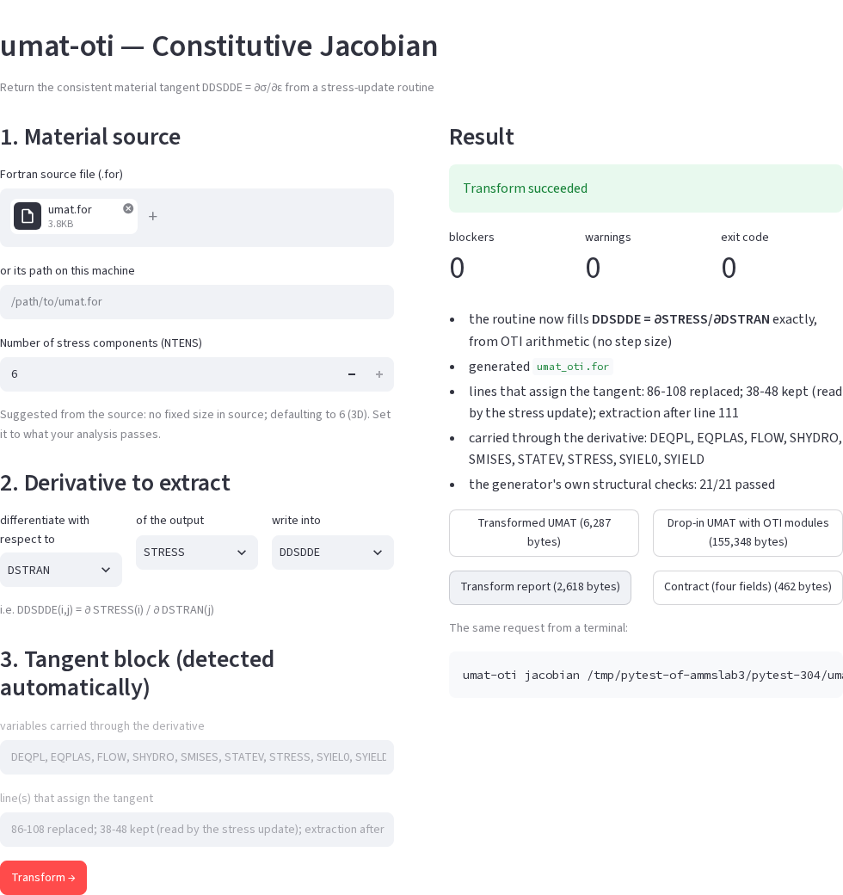
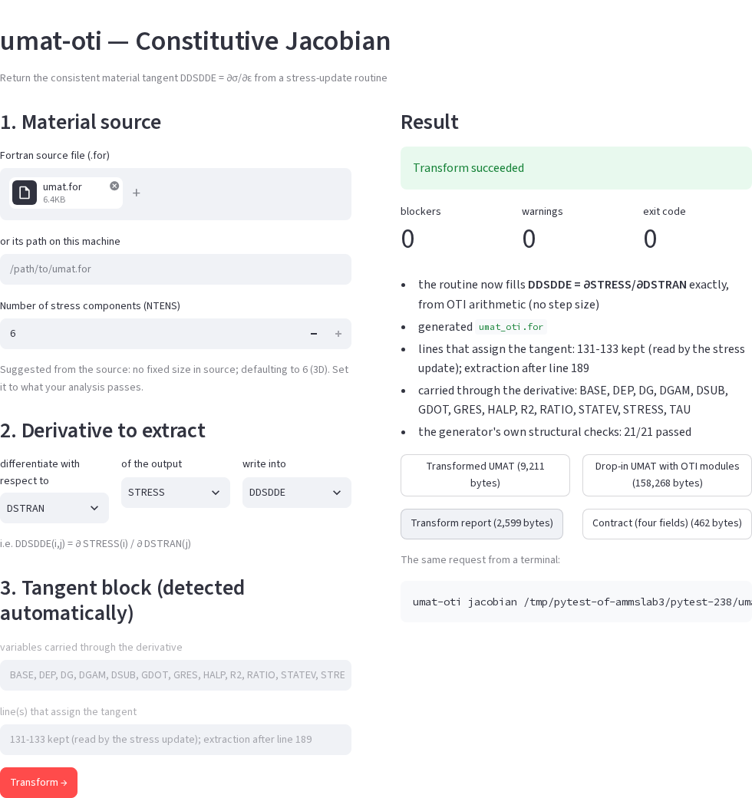
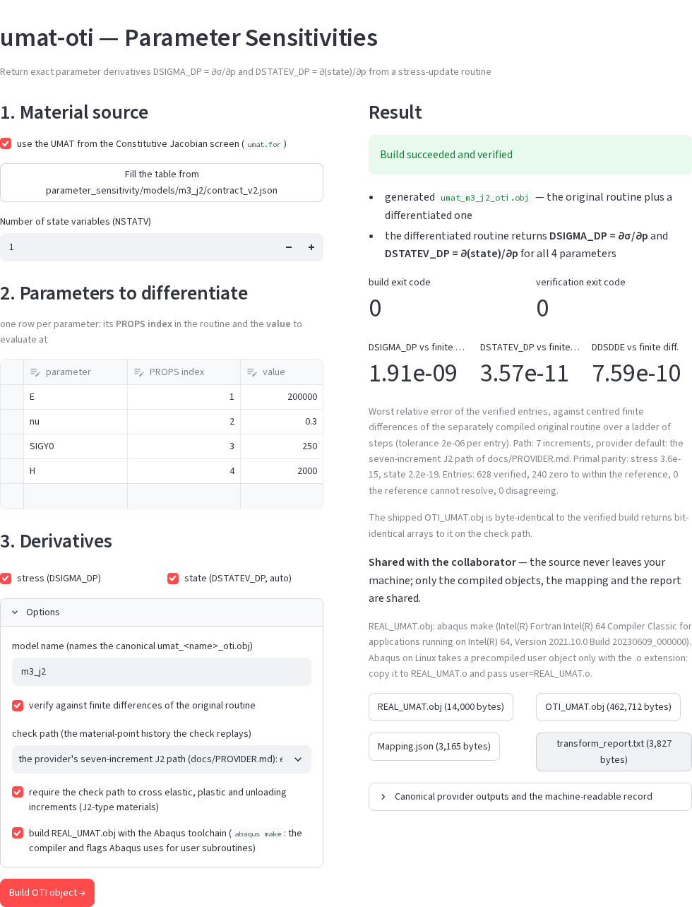
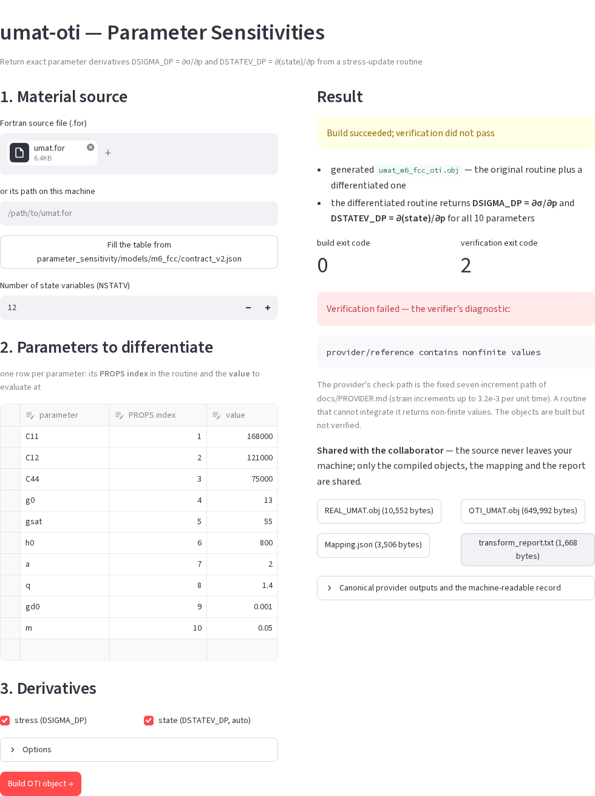

# GUI guide: a step-by-step walkthrough

UMAT-OTI has one graphical interface, a Streamlit application that runs in
your browser. Every button calls the same Python function as a command-line
tool, so the GUI and the CLI write the same files. This guide walks through
the application tab by tab: what to type, tick and click, what appears, what
you can download, and which command does the same thing.

For the reference of every field, the functions behind each button, and the
measured results of each screen, see [GUI.md](GUI.md). For the commands, see
[CLI_GUIDE.md](CLI_GUIDE.md).

## 1. Start the GUI

From the repository root, with the virtual environment active
([INSTALL.md](INSTALL.md)):

```bash
streamlit run scripts/app.py
```

Streamlit prints a local URL, by default `http://localhost:8501`. Open it in
a browser. To stop the GUI, press `Ctrl+C` in the terminal.

Useful variants:

```bash
streamlit run scripts/app.py --server.port 8502                       # another port
streamlit run scripts/app.py --server.headless true --server.port 8501 # no browser is opened
```

On a remote machine, forward the port over SSH (for example
`ssh -L 8501:localhost:8501 user@host`) and open the local URL.

### Where the GUI writes

| Tabs | Default folder | Change it with |
| --- | --- | --- |
| **Constitutive Jacobian**, **Parameter Sensitivities** | `umat_oti_workspace/gui/` in the checkout (a new subfolder for every click) | `UMAT_OTI_GUI_WORKSPACE` |
| **Start here** and the numbered tabs | `umat_oti_workspace/` in the folder where you started Streamlit | `UMAT_OTI_WORKSPACE` |

`umat_oti_workspace/` is ignored by git. Earlier results are never
overwritten.

### The layout

The page has nine tabs along the top:

| Tab | For | Needs |
| --- | --- | --- |
| **Start here** | a one-click demo and a check of this machine | `gfortran` |
| **Constitutive Jacobian** | the consistent tangent `DDSDDE` of your UMAT, from four fields | `gfortran` |
| **Parameter Sensitivities** | the compiled provider with `DSIGMA_DP` and `DSTATEV_DP`, built and verified | `gfortran` (Abaqus optional) |
| **1. Load Config** to **5. Report** | the contract-driven console: transform from a JSON contract, then validate the original against the transformed UMAT in Abaqus | tabs 1-2: nothing or `gfortran`; tabs 3-5: Abaqus |
| **6. Corpus** | a browser for the results of a corpus round | a corpus round's results |

The **sidebar** on the left shows your progress ("Where you are": load a
contract, transform, compile, build the Abaqus workspace, run both jobs,
compare), the loaded contract, whether `gfortran` and `abaqus` were found, and
a note on which tab needs what. A step is ticked only when its own output file
says so.

## 2. Start here

Use this tab first. It needs only `gfortran` and takes a few seconds.

1. Read **What is on this machine**. It shows a green box for each tool
   found (for example ``gfortran found: `/usr/bin/gfortran` ``) and a warning
   for each one missing. Abaqus is needed only from tab 3 on.
2. Under **Transform one UMAT, right now**, leave **Also compile the generated
   Fortran** ticked.
3. Click **Run the demo transformation**. It transforms the linear elastic
   UMAT of `examples/elastic_minimal.json` (NTENS = 4) and compiles the result.
4. Four numbers appear. Measured on 2026-09-18: **Exit code** `0`,
   **Structural checks** `21/21`, **Blockers** `0`, **Compilation**
   `compiled`, followed by "All 21 structural checks passed."
5. Click **Download the drop-in UMAT** (146,981 bytes on 2026-09-18). This one
   file holds the transformed routine and every OTI module it needs, with the
   standard UMAT interface. The expander **First 60 lines of what was
   generated** shows its beginning.

The demo also loads the contract, so tabs **1. Load Config** and **2.
Transform** open with it.

**Same thing from the command line:**

```bash
umat-oti-config --config examples/elastic_minimal.json --out umat_oti_workspace/demo --compile
```

## 3. Constitutive Jacobian

Use this tab to make any UMAT return the exact consistent tangent. You fill
in four fields and click once; you do not write a contract.



1. **1. Material source.** Drag your `.for` file onto **Fortran source file
   (.for)**, or type its path into **or its path on this machine** (for
   example `parameter_sensitivity/models/m3_j2/umat.for`).
2. **Number of stress components (NTENS).** The screen suggests a value from
   the source and says why (for example "no fixed size in source; defaulting
   to 6 (3D)"). Set it to what your analysis passes: 6 for 3D, 4 for plane
   strain or axisymmetry, 3 for plane stress.
3. **2. Derivative to extract.** Leave **differentiate with respect to**
   `DSTRAN`, **of the output** `STRESS`, **write into** `DDSDDE`. The line
   below spells it out: `DDSDDE(i,j) = ∂ STRESS(i) / ∂ DSTRAN(j)`.
4. **3. Tangent block (detected automatically).** Before you click anything,
   two read-only fields show what the transformer found:
   - **variables carried through the derivative**, for the J2 UMAT `DEQPL,
     EQPLAS, FLOW, SHYDRO, SMISES, STATEV, STRESS, SYIEL0, SYIELD`;
   - **line(s) that assign the tangent**, for the J2 UMAT `86-108 replaced;
     38-48 kept (read by the stress update); extraction after line 111`.
     A hand-written tangent after the stress update is *replaced*; an
     assignment the stress update itself reads (an elastic predictor) is
     *kept*.
5. Click **Transform →**.
6. On the right, **Result** shows **Transform succeeded**, the counts of
   **blockers**, **warnings** and the **exit code**, and a summary with the
   structural checks (21/21 for the J2 UMAT).
7. Download what you need:
   - **Drop-in UMAT with OTI modules**: the file to give Abaqus;
   - **Transformed UMAT**: the routine alone;
   - **Transform report**: what was changed and checked;
   - **Contract (four fields)**: your request as a JSON contract, for
     `umat-oti-config`.
8. Under **The same request from a terminal** the screen prints the exact
   `umat-oti jacobian` command, including the output folder it used.

The files are byte-identical to those of the printed command. This was
checked on 2026-09-18 for the J2 and elastic UMATs of
[Example 1](../examples/01_elastic_tangent/README.md) and
[Example 2](../examples/02_j2_plasticity_tangent/README.md), which also show
how to check the downloaded tangent against finite differences.

The crystal-plasticity routine of Example 4 gives this screen:



**Same thing from the command line:**

```bash
umat-oti jacobian parameter_sensitivity/models/m3_j2/umat.for --ntens 6 --out umat_oti_workspace/j2 --compile
```

## 4. Parameter Sensitivities

Use this tab to build the compiled material provider: the files you give a
collaborator so that they can compute parameter sensitivities without your
source code. The build is verified entry by entry against finite differences
of your original routine.



1. **1. Material source.** If you used the Constitutive Jacobian tab, tick
   **use the UMAT from the Constitutive Jacobian screen**. Otherwise upload the
   file or type its path. The provider lifts the **original** routine, not the
   `DDSDDE`-transformed file.
2. If the source is one of the models that ship with the repository, a button
   **Fill the table from parameter_sensitivity/models/<model>/contract_v2.json**
   appears. Click it to fill the table and NSTATV from that model's contract.
3. **Number of state variables (NSTATV).** The size of `STATEV` your routine
   uses (1 for the J2 model, 12 for the FCC model).
4. **2. Parameters to differentiate.** One row per parameter: its name, its
   **PROPS index**, and the **value** at which to evaluate. Every `PROPS` slot
   up to the largest index needs a row, because the check runs your original
   routine and that needs a value in every slot. Add rows in the empty last
   line.
5. **3. Derivatives.** **stress (DSIGMA_DP)** is what the provider builds and
   stays ticked. **state (DSTATEV_DP, auto)** is carried whenever NSTATV > 0.
6. Open **Options**:
   - **model name** names the canonical object `umat_<name>_oti.obj`;
   - **verify against finite differences of the original routine**: keep it
     ticked;
   - **check path**: the loading history of the check. Choose *the provider's
     seven-increment J2 path* for J2-type plasticity, *tension with shear* for
     crystal plasticity or any model with shear parameters, or *uniaxial
     strain*. A parameter the path never exercises is reported *unresolved*,
     not verified;
   - **require the check path to cross elastic, plastic and unloading
     increments**: tick it for J2-type materials only;
   - **build REAL_UMAT.obj with the Abaqus toolchain**: ticked by default when
     `abaqus` is on `PATH`; it compiles the regular object with `abaqus make`.
     Untick it to use gfortran.
7. Click **Build OTI object →**. Measured on 2026-09-18, the build and check
   of the ten-parameter FCC model took 33 s on this screen; the J2 model takes
   about half that (17 s for the same commands from the terminal).
8. **Result** shows **Build succeeded and verified**, the build and
   verification exit codes, and the worst relative error of the verified
   entries of `DSIGMA_DP`, `DSTATEV_DP` and `DDSDDE`. For the FCC model with
   the values of [Example 4](../examples/04_fcc_crystal_plasticity_provider/README.md)
   on the tension-with-shear path, the screen showed `5.69e-08`, `1.03e-09`
   and `3.47e-08` on 2026-09-18. The caption below gives the entry counts
   (verified, zero to within the reference, unresolved, disagreeing) and
   primal parity.
9. Under **Shared with the collaborator**, download the four files:
   **REAL_UMAT.obj** (the original routine compiled unchanged),
   **OTI_UMAT.obj** (the provider), **Mapping.json** (the parameter and
   derivative mapping, with the SHA-256 of both objects) and
   **transform_report.txt** (build and verification results). The source is
   not among them.
10. The expander **Canonical provider outputs and the machine-readable
    record** holds the canonical object and contract and the exact terminal
    command.



If verification fails, the result says **Build succeeded; verification did
not pass** and shows the verifier's diagnostic. If the routine returns
non-finite values on the chosen path, a note suggests a gentler check path.

**Same thing from the command line** (the GUI writes this contract for you
from the table):

```bash
python -m umat_oti.provider.collaborator parameter_sensitivity/models/m3_j2/contract_v2.json \
    --out umat_oti_workspace/j2_package --j2-branches
```

Walk-throughs with every number: [Example 3](../examples/03_j2_parameter_sensitivities/README.md)
(J2) and [Example 4](../examples/04_fcc_crystal_plasticity_provider/README.md)
(FCC crystal).

## 5. The numbered tabs: the contract-driven console

These tabs work on one JSON **contract**, the file that tells the transformer
which routine to lift, the size of the stress tensor, the derivative order and
what to seed and promote. Tabs 1 and 2 need at most `gfortran`. Tabs 3 to 5
run the original and the transformed UMAT in Abaqus and compare them.

### 1. Load Config

1. Open **Contracts in this checkout** and choose one. The list holds the
   contracts in `examples/` (the place to start), `json_files/` (benchmark
   contracts) and `user_jsons/` (your own). Choosing one loads it at once.
2. Or upload a JSON file on the right and click **Use uploaded**.
3. The tab shows the contract's name, **NTENS**, **Derivative order**, the
   number of extra contracts and helper surfaces, the UMAT file and routine,
   and whether that UMAT file exists on disk ("The UMAT source this contract
   names is on disk, so the transform on tab 2 can run.").
4. Optional: **Advanced: edit the derivative requests before transforming**
   lets you add rows (for example higher-order or parameter derivatives) and
   name `PROPS` and `STATEV` entries. Click **Apply derivative requests** to
   use them, or **Download unified config** to keep them.
5. **Raw JSON** shows the whole contract.

### 2. Transform

1. Check **Output directory** (default
   `umat_oti_workspace/gui_<name>/oti_transform/<name>`).
2. Leave **Also compile the generated Fortran (gfortran)** ticked. Generated
   Fortran that does not compile is found in seconds here, instead of inside
   an Abaqus job.
3. Click **Run transformation**. Or, on the right, **Use existing transform**
   to reuse the most recent one on disk.
4. The tab shows the structural checks, the compilation status and the anchor
   status, then the **Transform report** (success, blockers, warnings,
   generated files, raw report).
5. Download **Drop-in UMAT (combined)**, **Derivative manifest** and
   **Transform report**.

**Same thing from the command line:** `umat-oti config <contract> --out <dir> --compile`.

### 3. Validate (needs Abaqus)

This tab builds a single-element Abaqus job for the original UMAT and one for
the transformed UMAT, runs both, and compares them increment by increment.

1. Set **Workspace label** and **Validation directory**.
2. Choose a **Material test mode** that the material actually exercises (for
   example *single element plastic tension* for a plastic model; an
   elastic-only path does not test a plastic branch).
3. Choose **Compare outputs**: `STRESS`, `STATEV`, `DDSDDE`,
   `CONSTITUTIVE_JACOBIANS`, `CONVERGENCE`. Keep `CONSTITUTIVE_JACOBIANS` for
   tab 4.
4. Set **Abaqus command**, and on a cluster **Abaqus modules** and **Run prefix
   (srun/...)**.
5. Click the four buttons in order: **1. Build workspace**, **2. Run Abaqus
   jobs**, **3. Extract ODB**, **4. Compare results**. Each needs the one
   before it. The **Status** panel below follows them.

Without Abaqus you can still click **1. Build workspace** and take the decks
and run scripts it writes to a machine that has Abaqus. The same functions run
from the command line as `umat-oti-batch --config-dir <folder> --batch-dir
<dir> --validate`. This tab was not run for this guide.

### 4. Constitutive Jacobians

After tab 3 has extracted results, this tab plots the tangent of the original
and of the transformed UMAT, component by component and increment by
increment (`DDSDDE(1,1)`, `DDSDDE(4,4)` and the components you select). Two
curves on top of each other is the intended result. Until then the tab says
**Locked**.

### 5. Report

Everything the validation workspace wrote: the comparison report and the
validation report, rendered, and a download button for every file. Locked
until tab 3 has built a workspace.

### 6. Corpus

A browser for a corpus round: every acquired third-party UMAT, how far it got
through the acceptance gates, and why it stopped. It reads the results of a
round that was run elsewhere. Set `UMAT_OTI_CORPUS_RESULTS` and
`UMAT_OTI_CORPUS_WORK` to where they are; without them the tab says which
folder it looked in. The corpus and its gates are described in
[CORPUS_VERIFICATION.md](CORPUS_VERIFICATION.md).

## 6. GUI and command line side by side

| GUI | Command |
| --- | --- |
| Start here → **Run the demo transformation** | `umat-oti-config --config examples/elastic_minimal.json --out <dir> --compile` |
| Constitutive Jacobian → **Transform →** | `umat-oti jacobian <umat> --ntens <n> --out <dir>` |
| Parameter Sensitivities → **Build OTI object →** | `python -m umat_oti.provider.collaborator <contract> --out <dir>` (which runs `umat-oti-provider build` and the verifier) |
| 2. Transform → **Run transformation** | `umat-oti config <contract> --out <dir> --compile` |
| 3. Validate → the four buttons | `umat-oti-batch --config-dir <folder> --batch-dir <dir> --validate` |

Internal Jacobians (Example 5) and the twenty-model sweep (Example 6) have no
GUI screen; use the commands in their READMEs.

## 7. Two narrower interfaces

Two smaller front ends over the same services ship with the repository. They
compute nothing the main application does not.

```bash
streamlit run src/umat_oti/app/workbench_app.py   # a four-step guided wizard for one transformation
streamlit run src/umat_oti/app/unified_app.py     # a plain-language view without Abaqus vocabulary
```

## 8. Troubleshooting

| Problem | Fix |
| --- | --- |
| `streamlit: command not found` | Activate the virtual environment, or run `python -m streamlit run scripts/app.py`. |
| The page does not open | Open the URL Streamlit printed. On a remote machine, forward the port with `ssh -L`. If the port is busy, add `--server.port 8502`. |
| "gfortran not on PATH" on **Start here** | Install it (`sudo apt install gfortran`) and restart the GUI. |
| Tabs 2 to 5 say **Locked** | Load a contract on tab 1 (or run the demo on **Start here**). Tabs 4 and 5 also need tab 3 to have run. |
| The **Transform →** button is greyed out | Load a source first. An error under the tangent-block fields explains any other refusal (for example an unsupported NTENS). |
| The **Build OTI object →** button is greyed out | The warning above it says why: a missing parameter row for a `PROPS` slot, a duplicate name or index, or no source. |
| "Build succeeded; verification did not pass" | Read the diagnostic. A non-finite result usually means the check path is too violent for the model; choose another path under **Options**. |
| The Abaqus toolchain box cannot be ticked | `abaqus` is not on `PATH`. The build then uses gfortran for `REAL_UMAT.obj`. |
